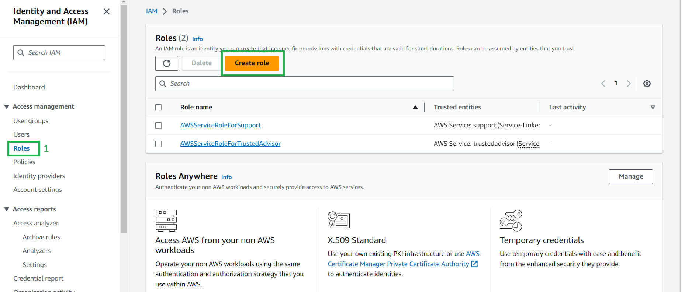
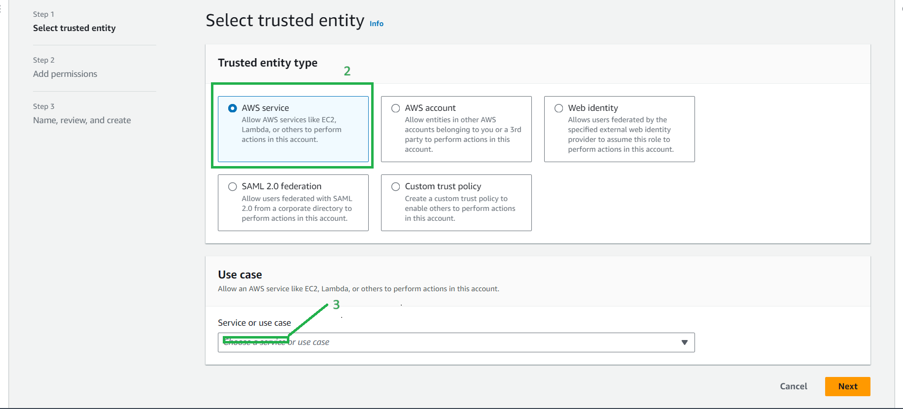
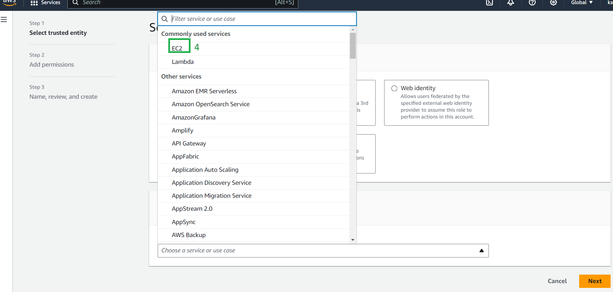
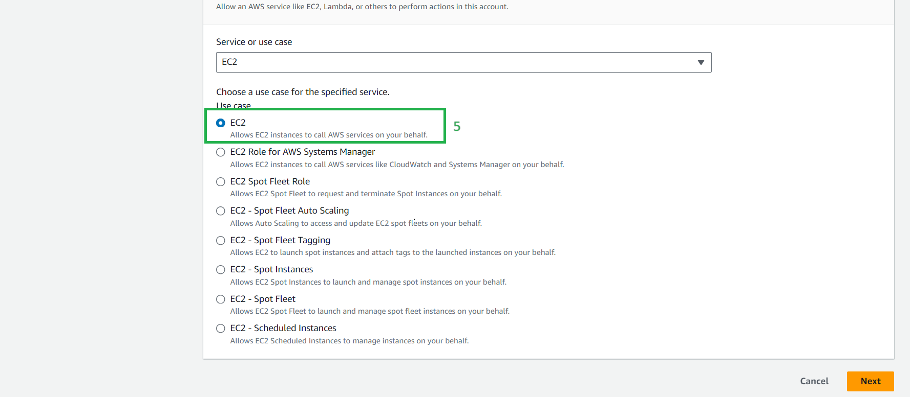
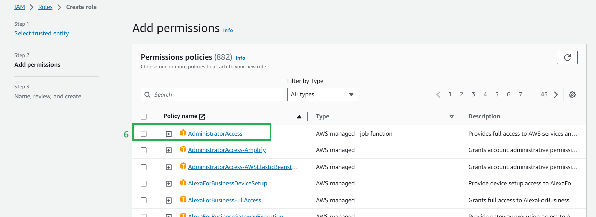
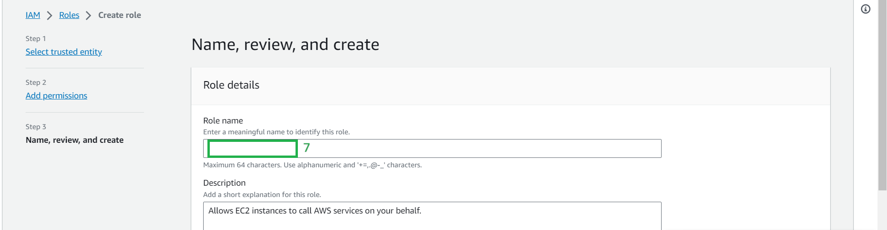
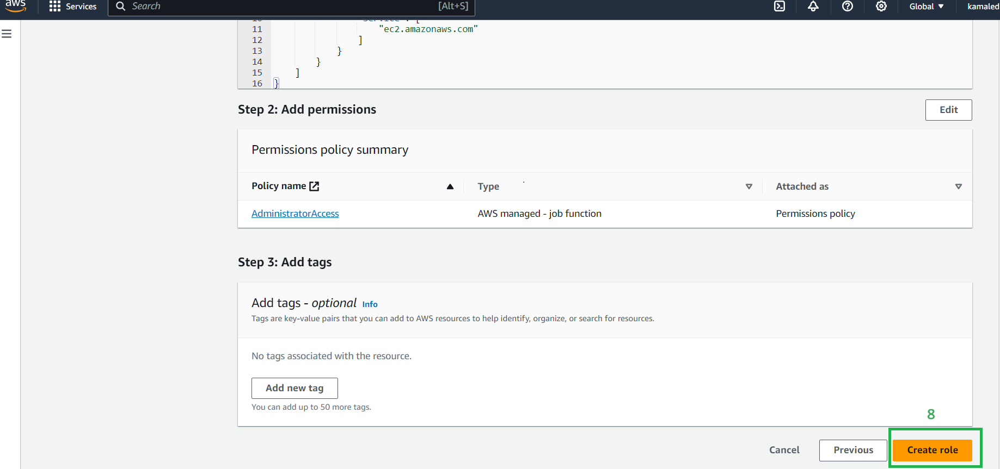

* # <ins>Creating a IAM  Role using console<ins>

* 1-> Select Roles and click on create Role

* 2->Select the type of entity depending on the type of access you want to give to the resource
* 3-> select a service from the drop down

* 4-> Select a service from the list

* 5-> Select a use case for that service

* 6-> Select the type of access

* 7-> Create a name for the role

* 8-> Select create role

