# <ins>Accessing IAM user using Command Line Interace(CLI)<ins>

* ##### This tutorial demonstrates accessing a IAM user using AWS CLI

* 1->Select IAM

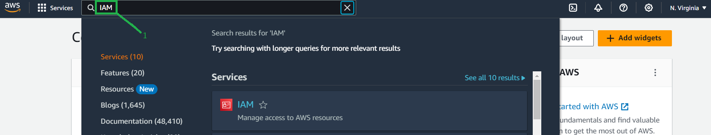

* 2-> Select USers

* 3->Select the user that created before

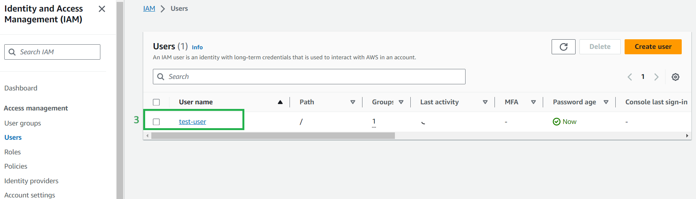

* 4-> Select the security credentials

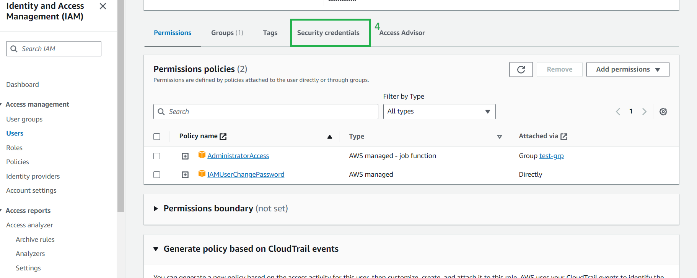

* 5-> Selct Access keys and select Create key

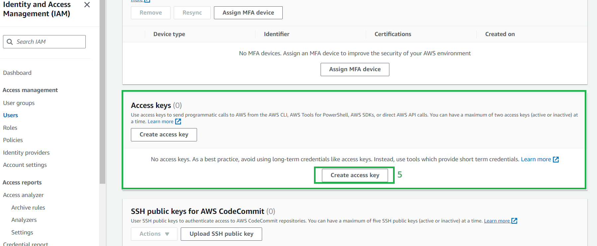

* 6->Select Command Line Interface

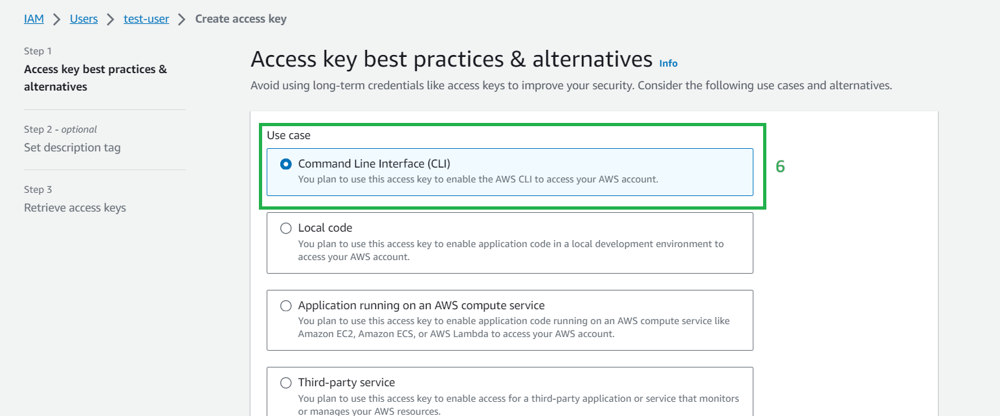

* 7->Create a Tag

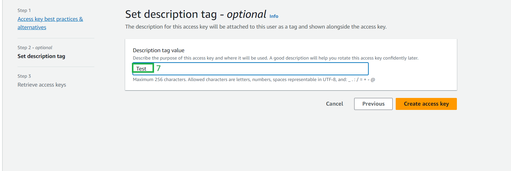

* 8->Download teh CSV file

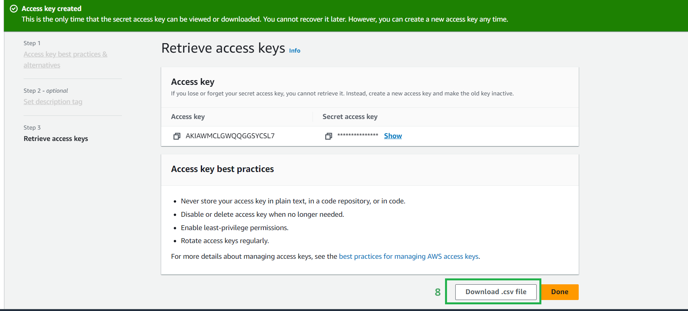

* 9->You can access the ID andd secret access key from the downloaded file

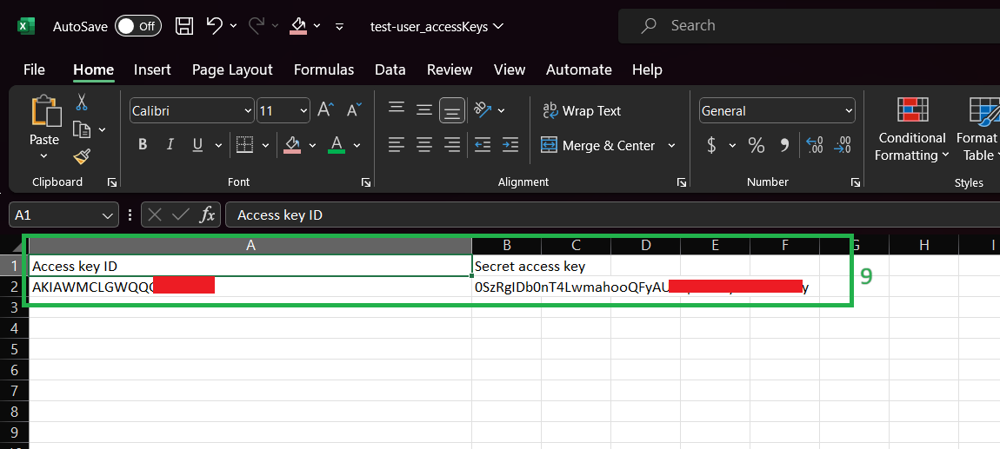

* 10->Open windows poweshell as an adminstrator

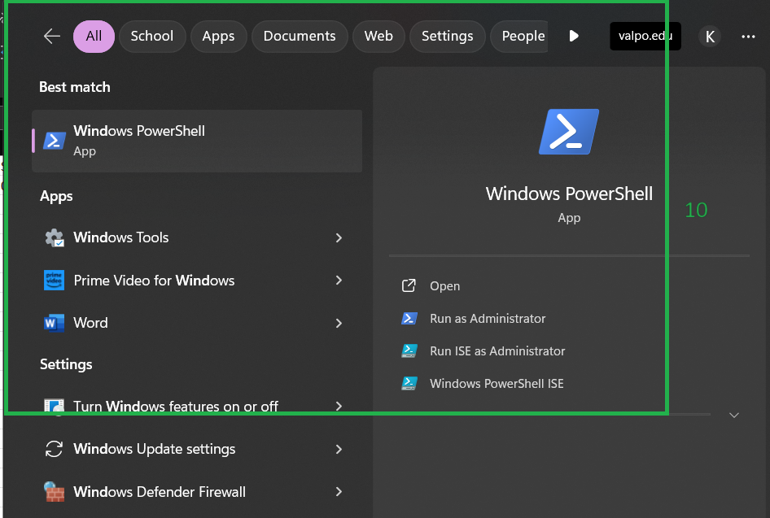

* 11->Enter the command AWS configure and provide the ID and key from the downloaded file and give region name and output format as JSON

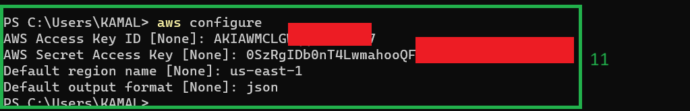

* 12->Now you can see the IAM user accessed using CLI

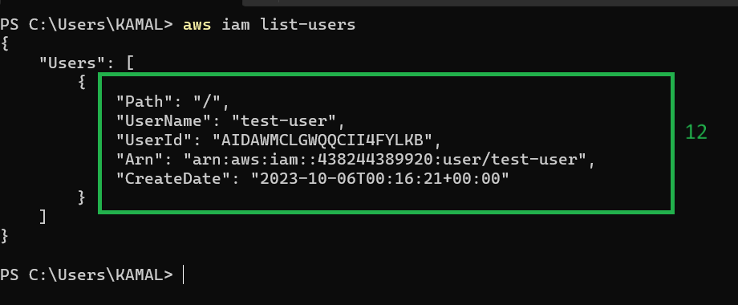
