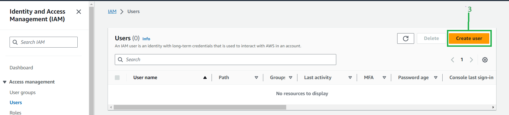
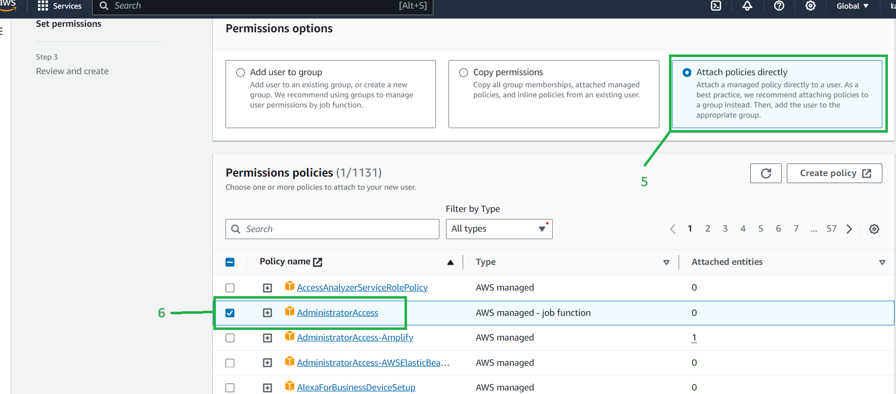
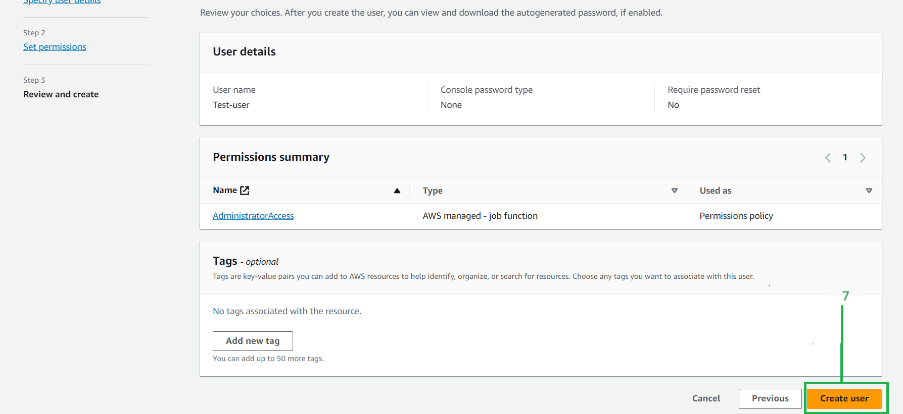

# <ins>Creating IAM user using AWS management console<ins>

* ##### This tutorial demonstrates creating a new IAM user with adminstrator access using AWS management console

* ##### You need to login as a root user to the management console to create an IAM user

#### <ins>Create user<ins>

* 1-> Select the IAM 

* 2-> Click on users

* 3-> Click on Create User

* 4->Give an user name

* 5->Select Attach policies directly

* 6->Select Adminstrator access

* 7->Select Create User

* ##### Now you can see a user has been created with the name test-user

# <ins>Create user group<ins>

* ##### This tutorial demonstrates creating user group using AWS management console

* 1-> Select the users

* 2-> Select Create group

* 3-> Create a group name

* 4-> Select the type of access

* ##### Now you can see a user has been created with the name test-grp

* # <ins>Adding an user to user group that we created or existing user groups<ins>

* 1-> Select the group name

* 2-> Select Add users

* 3-> Select the users you want to Add

* 4-> Add Users

* # <ins>Creating a IAM  Role using console<ins>

* 1-> Select Roles and click on create Role

* 2->Select the type of entity depending on the type of access you want to give to the resource
* 3-> select a service from the drop down

* 4-> Select a service from the list

* 5-> Select a use case for that service

* 6-> Select the type of access

* 7-> Create a name for the role

* 8-> Select create role

* # <ins>Creating a custom IAM policy<ins>

* 1->Select policies
* 2-> select Create policy

* 3-> Select the type of service as per the requirements

* 4-> Allow the access level as per the requirements

* 5->Slect the types of actions that needs to be run as per the policy

* 6-> Review the permissions and select create policy

* 7->Create a name for the policy

* 8->Select create policy

* 9->Now You can see a custom policy has been created based on the access given to the policy

