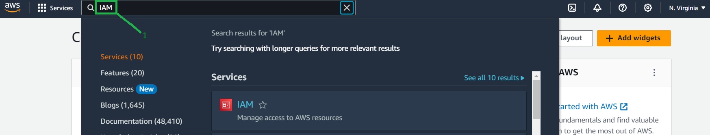

# <ins>Creating IAM user using AWS management console<ins>

* ##### This tutorial demonstrates creating a new IAM user with adminstrator access using AWS management console

* ##### You need to login as a root user to the management console to create an IAM user

#### <ins>Create user<ins>

* 1-> Select the IAM 

* 2-> Click on users

* 3-> Click on Create User

* 4->Give an user name

* 5->Select Attach policies directly

* 6->Select Adminstrator access

* 7->Select Create User

* ##### Now you can see a user has been created with the name test-user