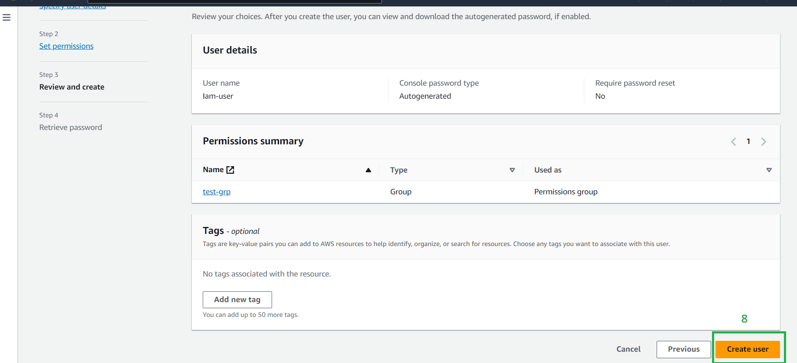
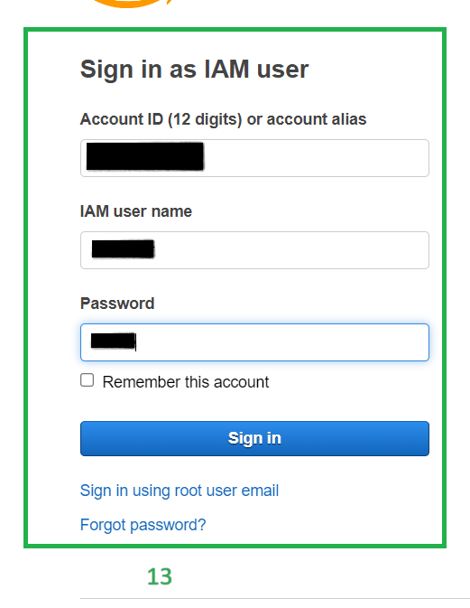

* # <ins>Creating and logging with IAM user to Management console<ins>

* 1->Create user

* 2->Create a name for the user
* 3->select provide access to management console
* 4->select create an IAM user

* 5->Select Auto-generated password(You can also create a custom password) and proceed to next step

* 6->Select add user to group
* 7->Add the user to user-group which has been already with the admistrator access or you can attach adminstrator access directly

* 8-> Review the details and create the user

9-> MAke sure to copy the password on the password screen it disappers once you go back to the users screen or alternatively you can download the csv file
* 10->Download the csv file

* 11->open the downloaded csv file from the downloads folder

* 12->Copy the username and password

* Go to the login page og management console
* 13->Select the IAM user
* Give the username from the downloaded csv file and proceed to next step

* 13->Give the usename and password from the downloaded csv file

* 14->Now you logged in as an IAM user to the management console with the adminstrator access

