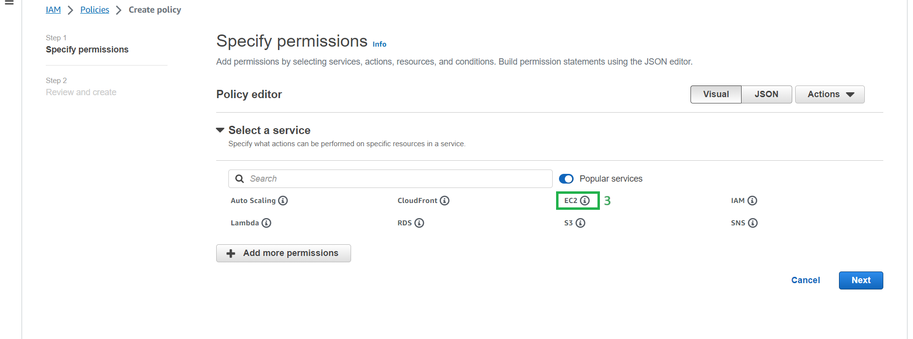
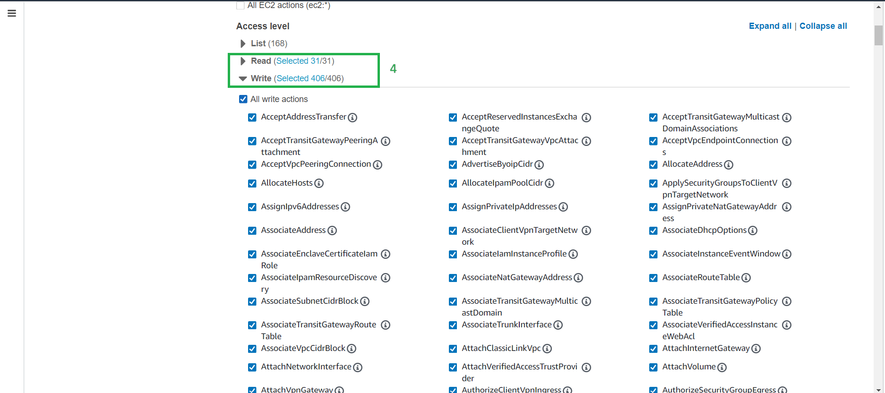
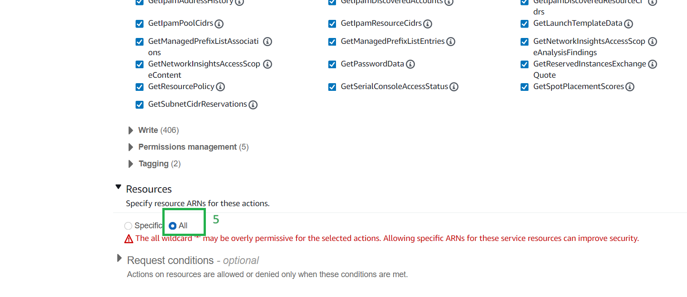
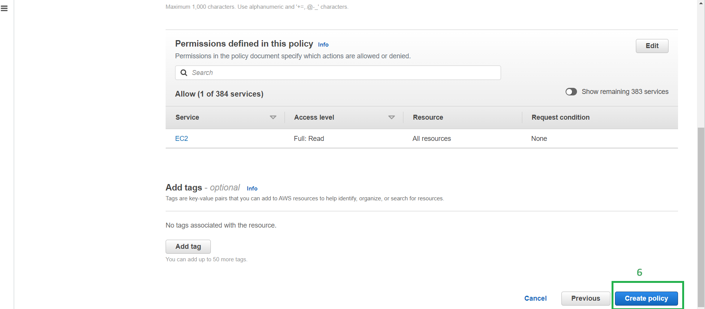
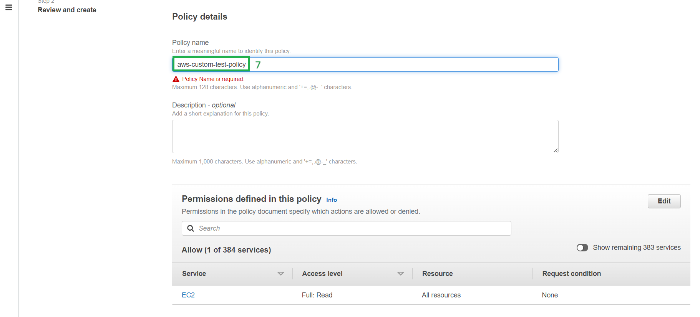
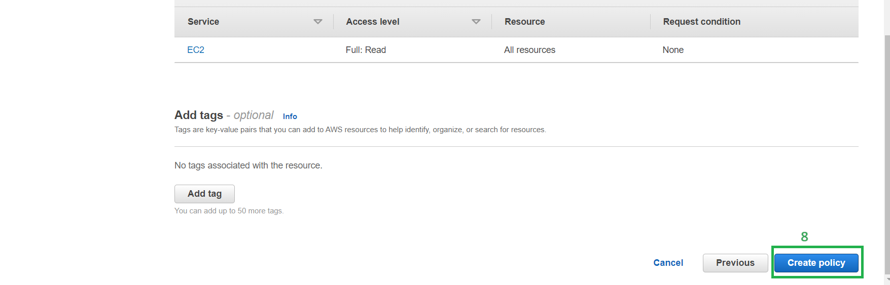
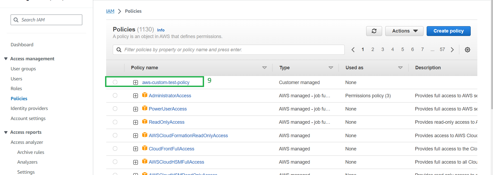

* # <ins>Creating a custom IAM policy<ins>

* 1->Select policies
* 2-> select Create policy

* 3-> Select the type of service as per the requirements

* 4-> Allow the access level as per the requirements

* 5->Slect the types of actions that needs to be run as per the policy

* 6-> Review the permissions and select create policy

* 7->Create a name for the policy

* 8->Select create policy

* 9->Now You can see a custom policy has been created based on the access given to the policy

