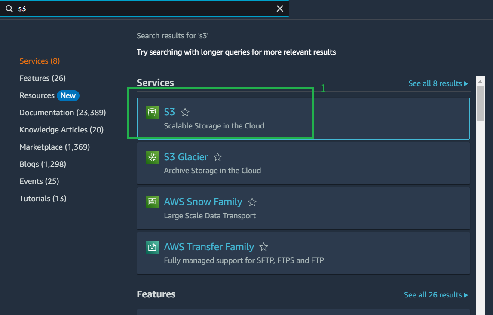
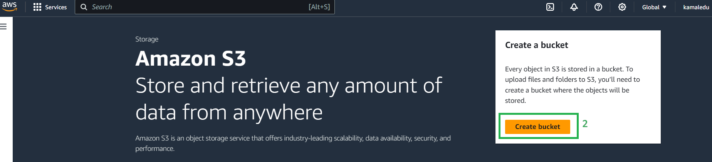
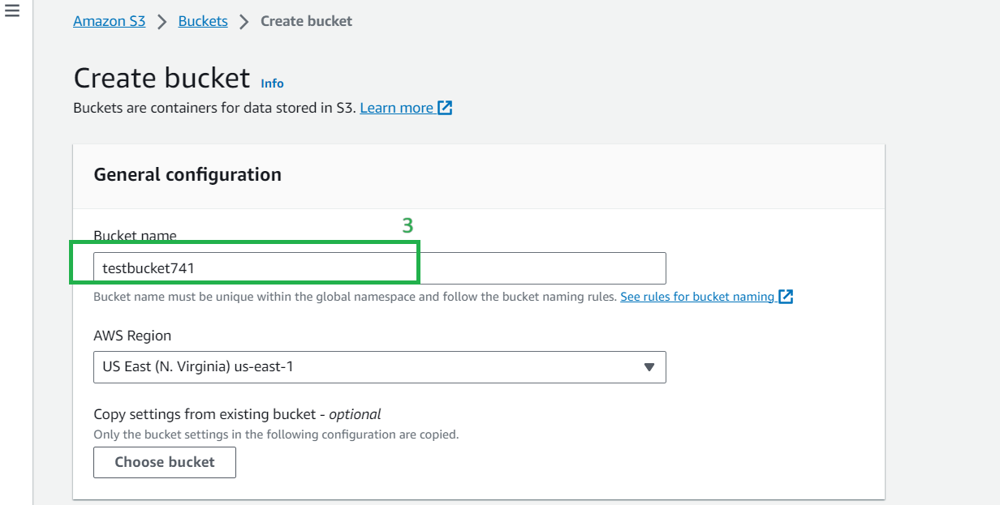
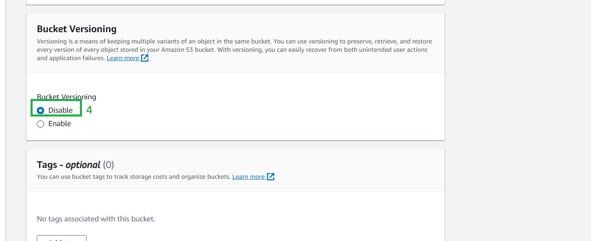
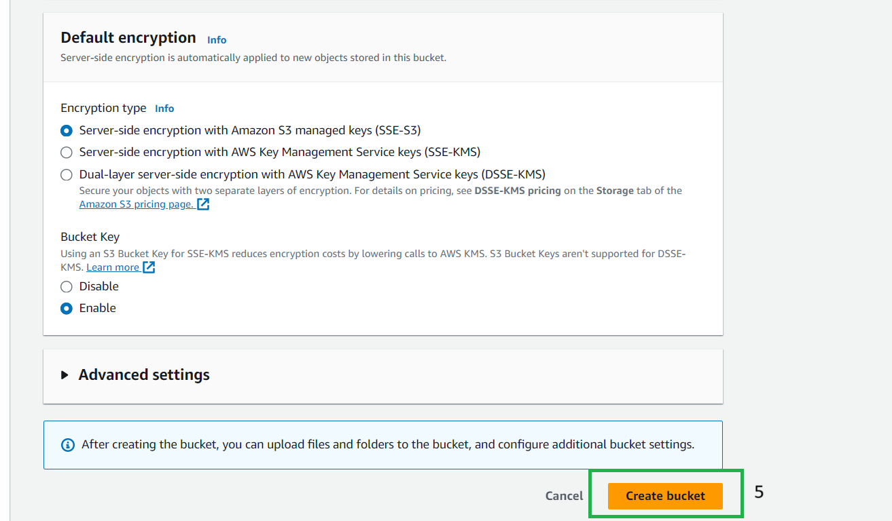

# <ins>This tutorial demonstrates S3 bucket creation using management console<ins>

* 1->Select the S3 bucket

* 2->select create bucket

* 3->Give a unique to the bucket

* 4->Keep the bucket version as disabled or enable as per the requirement as it increases the cost

* 5->Select create bucket

