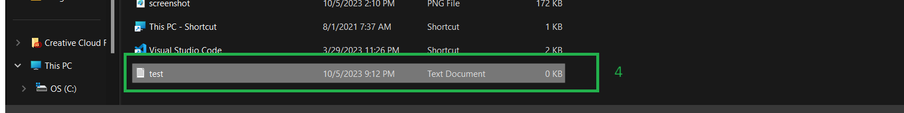

# <ins>This tutorial demonstrates  uploading a file S3 bucket from local system using management console<ins>

* 1->Select the S3 bucket that created before

* 2->select Upload

* 3->Select Add files or Add folder

* 4->Select a file from the local system

* 5->You can see the file name that needs to be uploaded
* 6->Select Upload

* 7->Now the file is uploaded to S3 bucket

