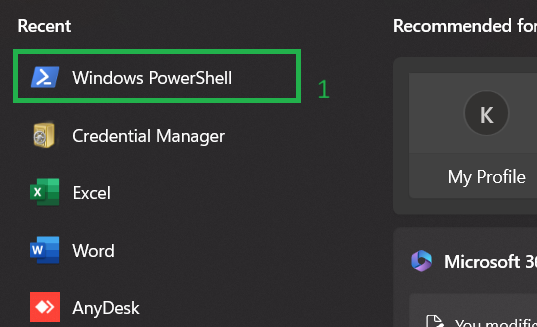
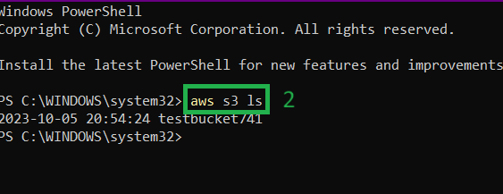
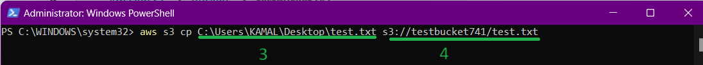
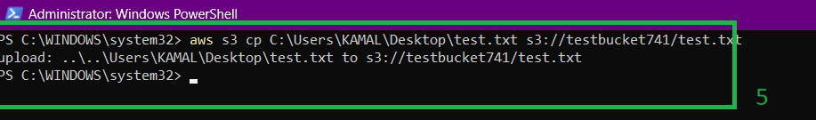
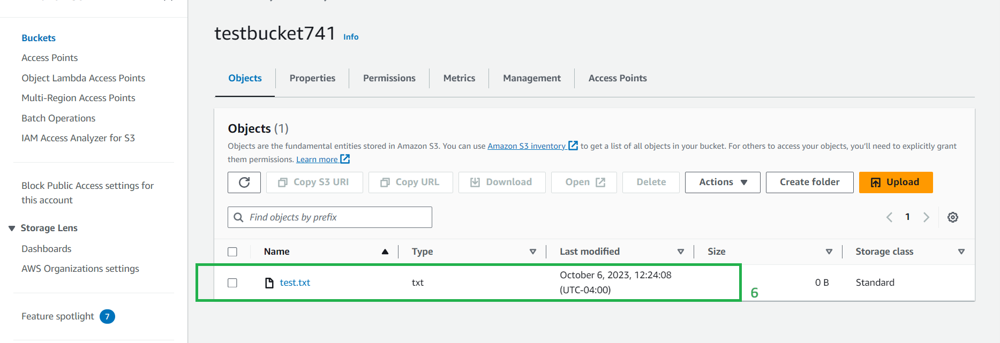

# <ins>This tutorial demonstrates  uploading a file S3 bucket from local system using management console<ins>

* 1->Open the windows powershell as Adminstrator

* 2->Enter the command as shown to verify bucket exists

* 3->Give the Local path of the file
* 4->Give the path of S3

* 4->File is uploaded to s3

* 6->Now you can check the file is saved into S3 bucket using console

