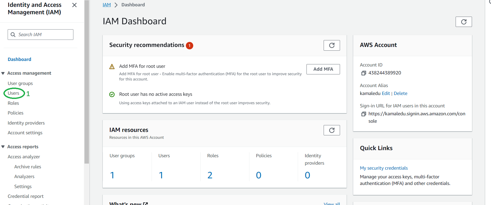
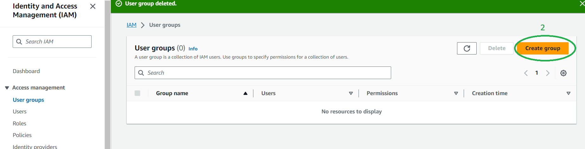
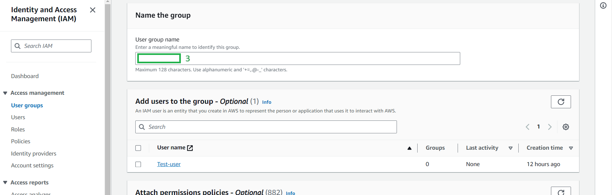
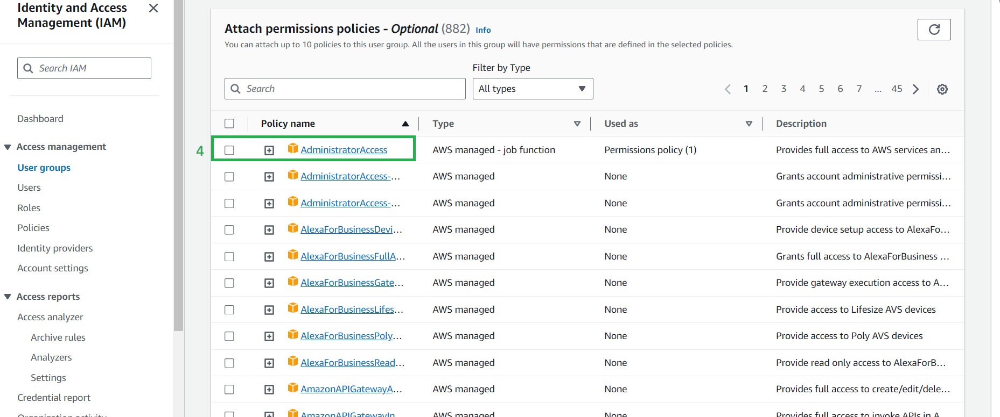
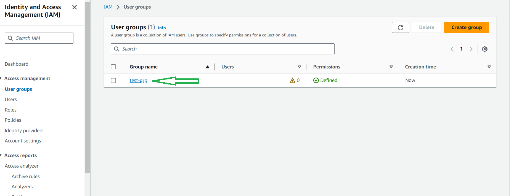

# <ins>Create user group<ins>

* ##### This tutorial demonstrates creating user group using AWS management console

* 1-> Select the users

* 2-> Select Create group

* 3-> Create a group name

* 4-> Select the type of access

* ##### Now you can see a user has been created with the name test-grp

